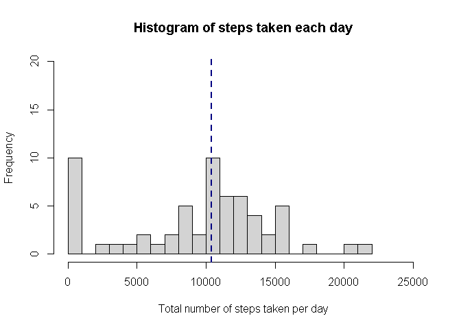
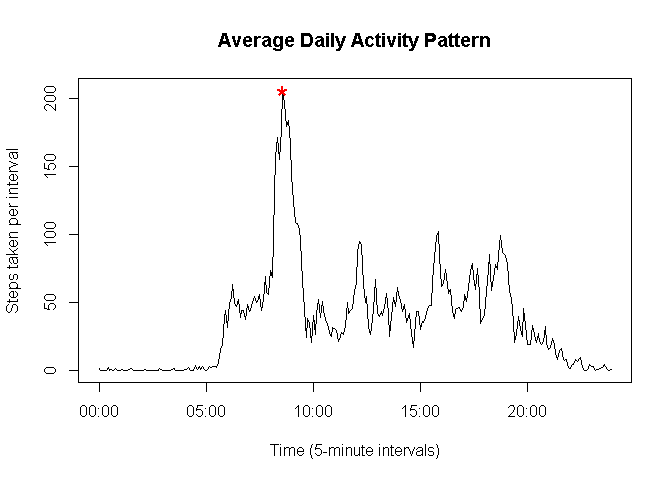
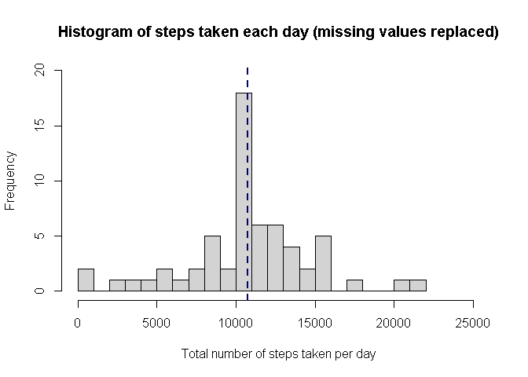
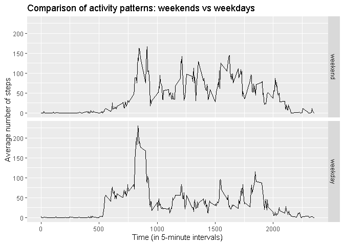

## Loading and exploring the data

Let's load data from the .CSV file into a dataframe, then look at its structure
and see how many missing values we have in the data frame:


```r
actData <- read.csv("data/activity.csv")
str(actData)
```

```
## 'data.frame':	17568 obs. of  3 variables:
##  $ steps   : int  NA NA NA NA NA NA NA NA NA NA ...
##  $ date    : chr  "2012-10-01" "2012-10-01" "2012-10-01" "2012-10-01" ...
##  $ interval: int  0 5 10 15 20 25 30 35 40 45 ...
```

```r
lapply(actData, function(x) sum(is.na(x)))
```

```
## $steps
## [1] 2304
## 
## $date
## [1] 0
## 
## $interval
## [1] 0
```

So, we've got some NAs (i.e. missing values) in the 'steps' column, and 
the rest of the columns are filled with data. Let's see what ranges of values 
we have in columns:


```r
range(actData$steps, na.rm = T)
```

```
## [1]   0 806
```

```r
unique(actData$interval)
```

```
##   [1]    0    5   10   15   20   25   30   35   40   45   50   55  100  105  110
##  [16]  115  120  125  130  135  140  145  150  155  200  205  210  215  220  225
##  [31]  230  235  240  245  250  255  300  305  310  315  320  325  330  335  340
##  [46]  345  350  355  400  405  410  415  420  425  430  435  440  445  450  455
##  [61]  500  505  510  515  520  525  530  535  540  545  550  555  600  605  610
##  [76]  615  620  625  630  635  640  645  650  655  700  705  710  715  720  725
##  [91]  730  735  740  745  750  755  800  805  810  815  820  825  830  835  840
## [106]  845  850  855  900  905  910  915  920  925  930  935  940  945  950  955
## [121] 1000 1005 1010 1015 1020 1025 1030 1035 1040 1045 1050 1055 1100 1105 1110
## [136] 1115 1120 1125 1130 1135 1140 1145 1150 1155 1200 1205 1210 1215 1220 1225
## [151] 1230 1235 1240 1245 1250 1255 1300 1305 1310 1315 1320 1325 1330 1335 1340
## [166] 1345 1350 1355 1400 1405 1410 1415 1420 1425 1430 1435 1440 1445 1450 1455
## [181] 1500 1505 1510 1515 1520 1525 1530 1535 1540 1545 1550 1555 1600 1605 1610
## [196] 1615 1620 1625 1630 1635 1640 1645 1650 1655 1700 1705 1710 1715 1720 1725
## [211] 1730 1735 1740 1745 1750 1755 1800 1805 1810 1815 1820 1825 1830 1835 1840
## [226] 1845 1850 1855 1900 1905 1910 1915 1920 1925 1930 1935 1940 1945 1950 1955
## [241] 2000 2005 2010 2015 2020 2025 2030 2035 2040 2045 2050 2055 2100 2105 2110
## [256] 2115 2120 2125 2130 2135 2140 2145 2150 2155 2200 2205 2210 2215 2220 2225
## [271] 2230 2235 2240 2245 2250 2255 2300 2305 2310 2315 2320 2325 2330 2335 2340
## [286] 2345 2350 2355
```

```r
range(actData$interval)
```

```
## [1]    0 2355
```

```r
unique(actData$date)        
```

```
##  [1] "2012-10-01" "2012-10-02" "2012-10-03" "2012-10-04" "2012-10-05"
##  [6] "2012-10-06" "2012-10-07" "2012-10-08" "2012-10-09" "2012-10-10"
## [11] "2012-10-11" "2012-10-12" "2012-10-13" "2012-10-14" "2012-10-15"
## [16] "2012-10-16" "2012-10-17" "2012-10-18" "2012-10-19" "2012-10-20"
## [21] "2012-10-21" "2012-10-22" "2012-10-23" "2012-10-24" "2012-10-25"
## [26] "2012-10-26" "2012-10-27" "2012-10-28" "2012-10-29" "2012-10-30"
## [31] "2012-10-31" "2012-11-01" "2012-11-02" "2012-11-03" "2012-11-04"
## [36] "2012-11-05" "2012-11-06" "2012-11-07" "2012-11-08" "2012-11-09"
## [41] "2012-11-10" "2012-11-11" "2012-11-12" "2012-11-13" "2012-11-14"
## [46] "2012-11-15" "2012-11-16" "2012-11-17" "2012-11-18" "2012-11-19"
## [51] "2012-11-20" "2012-11-21" "2012-11-22" "2012-11-23" "2012-11-24"
## [56] "2012-11-25" "2012-11-26" "2012-11-27" "2012-11-28" "2012-11-29"
## [61] "2012-11-30"
```

```r
length(unique(actData$date)); range(actData$date)
```

```
## [1] 61
```

```
## [1] "2012-10-01" "2012-11-30"
```

Now let's take a look at the distribution of the observations in time.
We have 5-minute intervals, so the dataset should consist of 12 intervals per 
each hour * 24 hours per day = 288 records per date. Is that true?


```r
table(actData$date)
```

```
## 
## 2012-10-01 2012-10-02 2012-10-03 2012-10-04 2012-10-05 2012-10-06 2012-10-07 
##        288        288        288        288        288        288        288 
## 2012-10-08 2012-10-09 2012-10-10 2012-10-11 2012-10-12 2012-10-13 2012-10-14 
##        288        288        288        288        288        288        288 
## 2012-10-15 2012-10-16 2012-10-17 2012-10-18 2012-10-19 2012-10-20 2012-10-21 
##        288        288        288        288        288        288        288 
## 2012-10-22 2012-10-23 2012-10-24 2012-10-25 2012-10-26 2012-10-27 2012-10-28 
##        288        288        288        288        288        288        288 
## 2012-10-29 2012-10-30 2012-10-31 2012-11-01 2012-11-02 2012-11-03 2012-11-04 
##        288        288        288        288        288        288        288 
## 2012-11-05 2012-11-06 2012-11-07 2012-11-08 2012-11-09 2012-11-10 2012-11-11 
##        288        288        288        288        288        288        288 
## 2012-11-12 2012-11-13 2012-11-14 2012-11-15 2012-11-16 2012-11-17 2012-11-18 
##        288        288        288        288        288        288        288 
## 2012-11-19 2012-11-20 2012-11-21 2012-11-22 2012-11-23 2012-11-24 2012-11-25 
##        288        288        288        288        288        288        288 
## 2012-11-26 2012-11-27 2012-11-28 2012-11-29 2012-11-30 
##        288        288        288        288        288
```


## What is mean total number of steps taken per day?

First, we calculate the total number of steps taken per day:


```r
stepsPerDay <- with(actData, tapply(steps, date, sum, na.rm = TRUE))
rangePerDay <- range(stepsPerDay)
```

So, the total number of steps per day varies from 0 
to 21194.

Now, we calculate the mean and median of the total number of steps taken per day:


```r
meanPerDay <- round(mean(stepsPerDay))
medianPerDay <- median(stepsPerDay)
```

The mean is 9354 steps per day.
The median is 10395 steps per day.

Finally, we can make a histogram of the total number of steps taken each day:


```r
hist(stepsPerDay, breaks = 22, xlim = c(0, max(stepsPerDay)*1.2), 
     main = "Histogram of steps taken each day",
     xlab = "Total number of steps taken per day",
     ylim = c(0, 20))
abline(v = medianPerDay, lwd = 2, lty = 2, col = "navy")
```

<!-- -->


## What is the average daily activity pattern?

In order to see a pattern, we will make a time series plot 
of the 5-minute interval (x-axis) and the average number of steps taken, 
averaged across all days (y-axis):


```r
stepsPerInterval <- with(actData, tapply(steps, interval, mean, na.rm = TRUE))
meanSteps <- data.frame(steps = stepsPerInterval, 
                        interval = as.integer(names(stepsPerInterval)))
meanSteps$interval.time <- strptime(
    format(meanSteps$interval / 100, digits = 2),
    format = "%H.%M")
rm(stepsPerInterval)

maxSteps <- round(max(meanSteps$steps))
maxIntStart <- which.max(meanSteps$steps)
maxInterval <- c(meanSteps$interval.time[maxIntStart], 
                 meanSteps$interval.time[maxIntStart + 1])
```


```r
with(meanSteps, plot(interval.time, steps, type = "l", 
     xlab = "Time (5-minute intervals)", 
     ylab = "Steps taken per interval",
     main = "Average Daily Activity Pattern"))
points(maxInterval[1], maxSteps, cex = 2, col = "red", pch = "*")
```

<!-- -->

The maximum number of steps per one interval = 
206.

The interval with maximum number of steps is 
08:35 - 08:40.


## Imputing missing values

The presence of NAs introduces bias into our calculations and summaries. 
More precisely, our dataset contains 2304 records 
with missing values in the 'steps' column. Let's try to impute some data 
instead of those NAs.

We will apply a very simple strategy for filling in all of the missing values
in the dataset, that is for every NA we'll substitute the mean for the 
corresponding 5-minute time interval.

We create a new dataset that is equal to the original dataset but with 
the missing data filled in:


```r
library(dplyr)
```

```
## 
## Attaching package: 'dplyr'
```

```
## The following objects are masked from 'package:stats':
## 
##     filter, lag
```

```
## The following objects are masked from 'package:base':
## 
##     intersect, setdiff, setequal, union
```

```r
filledData <- actData %>% 
    merge(meanSteps, by = "interval") %>% 
    mutate(steps.x = ifelse(is.na(steps.x), round(steps.y), steps.x)) %>%
    mutate(steps.y = NULL) %>%
    rename(steps = steps.x) %>%
    select(c(steps, date, interval, interval.time))
```

Let's make sure that the new dataset contains no missing values:

```r
lapply(filledData, function(x) sum(is.na(x)))
```

```
## $steps
## [1] 0
## 
## $date
## [1] 0
## 
## $interval
## [1] 0
## 
## $interval.time
## [1] 0
```

```r
range(filledData$steps)
```

```
## [1]   0 806
```

Finally, we make a histogram of the total number of steps taken each day 
and calculate the mean and median total number of steps taken per day. 


```r
stepsPerDay2 <- with(filledData, tapply(steps, date, sum))
meanPerDay2 <- round(mean(stepsPerDay2))         
medianPerDay2 <- median(stepsPerDay2)            
```


```r
hist(stepsPerDay2, breaks = 22, xlim = c(0, max(stepsPerDay)*1.2), 
     main = "Histogram of steps taken each day (missing values replaced)",
     xlab = "Total number of steps taken per day",
     ylim = c(0, 20))
abline(v = medianPerDay2, lwd = 2, lty = 2, col = "navy")
```

<!-- -->

The mean is 10766 steps per day.
The median is 10762 steps per day.

These values differ from the estimates from the first part of the assignment. 
The impacts of imputing missing data on the estimates of the total daily number 
of steps are:

* we don't have days with zero steps taken anymore;

* the mean and the median have increased.


## Are there differences in activity patterns between weekdays and weekends?

In order to separate activity patterns for weekdays and weekends, we'll create 
a new factor variable in the dataset with two levels – “weekday” and “weekend” 
indicating whether a given date is a weekday or weekend day.


```r
filledData <- 
    filledData %>% 
    mutate(wday = ifelse(
        as.POSIXlt(filledData$date)$wday %in% c(0, 6),
        "weekend", "weekday")) %>%
    mutate(wday = factor(wday, levels = c("weekend", "weekday")))

totals <- filledData %>%
    group_by(wday, interval) %>%
    summarize(avg = mean(steps))
```

```
## `summarise()` has grouped output by 'wday'. You can override using the `.groups` argument.
```

Finally, we can make a panel plot containing a time series plot 
of the 5-minute interval (x-axis) and the average number of steps taken, 
averaged across all weekday days or weekend days (y-axis).


```r
library(ggplot2)
g <- ggplot(totals, aes(x = interval, y = avg)) +
    geom_line() +
    facet_grid(wday ~ .) +
    labs(x = "Time (in 5-minute intervals)", y = "Average number of steps") +
    labs(title = "Comparison of activity patterns: weekends vs weekdays")
print(g)
```

<!-- -->
